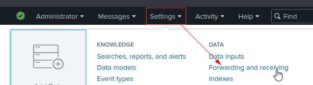
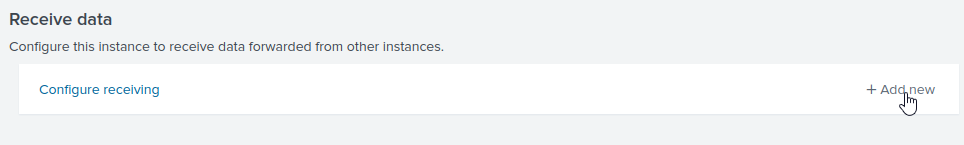
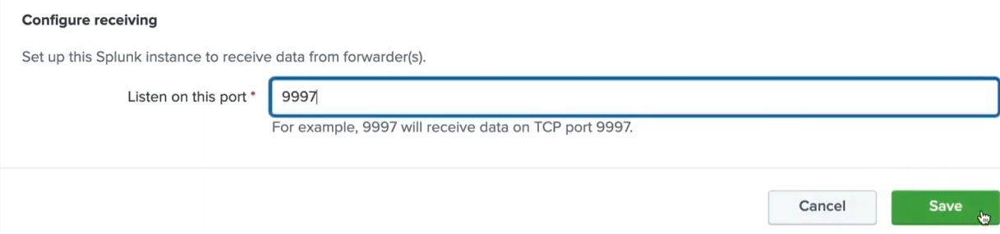
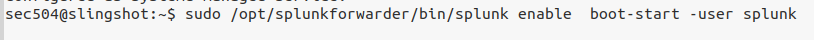
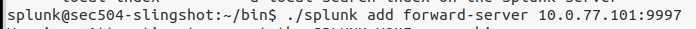
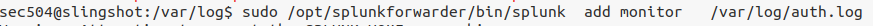
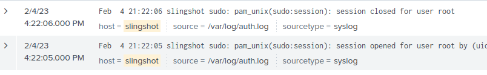

# Setting up a Splunk Indexer + Universal forwarder
---
- Configuring our splunk server to recieve logs
- We'll use the Universal Forwarder installed on systems we want to monitor to send data to our Splunk server

 

## Setting up a port for our Splunk server to recieve logs
---
- Go to settings-->Forwarding and Receiving 

- Click "Add new" 

- Choose a port you want to receive logs on, click save 

 

----------
-------
 

## Setting Up A Linux system to forward logs
---
- After configuring your indexer/reciever on your splunk server, hop on your Linux system you want to monitor and go to Splunks official website and download the Universal Forwarder compatible with your version of Linux
- Download the .deb file 

## Installing Universal forwarder on Linux
----------
- Go to the folder where you downloaded the forwarder, and type this command  
`sudo dpkg -i splunkforwarder_linux.deb`

## Start the Splunk Forwarder, enable boot on startup
----
- Switch to the "splunk" user. If a "splunk" user has not been created yet, first create the user which will be used to run our forwarder  
 `sudo adduser  --disabled-password   --no-create-home  splunk `

- Switch to the "splunk" user, cd into the directory  
`cd /opt/splunkforwarder/bin/`

- Then type this command to start the forwarder  
`./splunk start`

- It will ask you to accept the license and create a username/password for the forwarder

- Next Switch to Root or use elevated privileges on another user and enable forwarder bootup when system restarts as the "splunk" user  
`sudo /opt/splunkforwarder/bin/splunk enable  boot-start -user splunk`

    

## Setting the IP and port for the Forwarder to send logs to
----
- Switch over to the "splunk" user
- cd into /opt/splunkforwarder/bin
- Run this command  
`./splunk   add   forward-server  <Splunk_server_IP>:<Port>`

    

 

## Choosing a file to monitor
---
- Lets test a file to monitor. We are going to use the auth.log file located in /var/log/
- Run this command (Depending on which files your monitoring, you might need to switch users to use sudo)  
`sudo /opt/splunkforwarder/bin/splunk   add  monitor   /var/log/auth.log`
    
- Restart splunk now (might need sudo depending on which user you are)   
    `/opt/splunk/bin/splunk   restart`    

- Now check on your Splunk server that you are recieving the logs

- WooOOOooOO!! Looks like we are receiving the auth.log file
- Setup whatever files you want to monitor now and happy Splunkin!